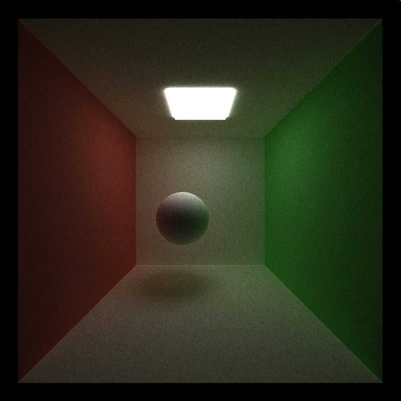

CUDA Path Tracer
================

**University of Pennsylvania, CIS 565: GPU Programming and Architecture, Project 3**

Ju Yang 

### Tested on: Windows 7, i7-4710MQ @ 2.50GHz 8GB, GTX 870M 6870MB (Hasee Notebook K770E-i7)

## TODOs finished: 
  ### 1. naive BRDF of reflection
I modified the scatterRay function in interaction.h to implement the basic BRDF

This picture is rendered with about 1000 iterations. 
Reflection parameter in scene files now has a meaning. 
If REFL is 0, that means it does not color any light. 
If REFL is between 0 and 1, it will color the light that hits it. The greater REFL is, the stronger effect it has.
I also modified the scene file "cornell.txt", adding numbers to the REFL from material 1 to material 3.

  ### 2. naive Refraction
I added a branch in scatterray function to implement the refraction. 

This picture is rendered with about 1000 iterations, in cornell2.txt, with an additional glass ball. 

